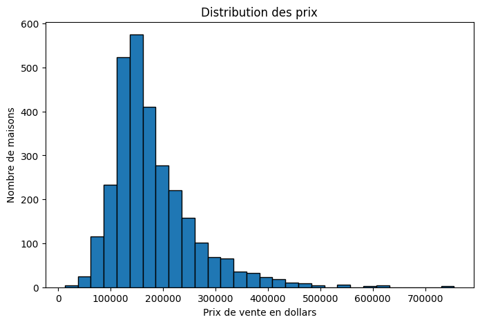
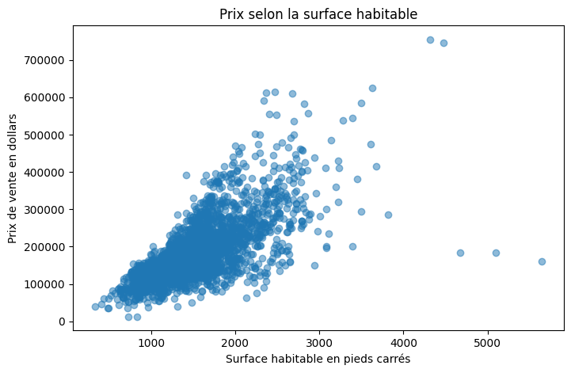
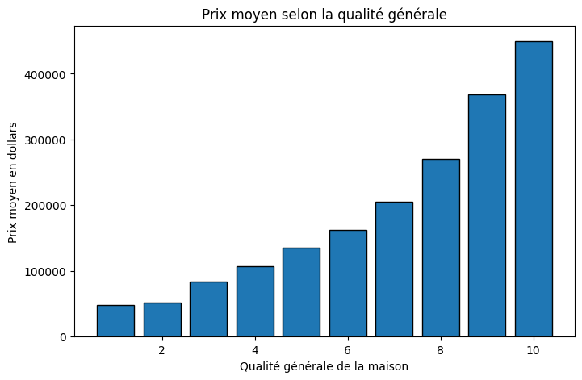
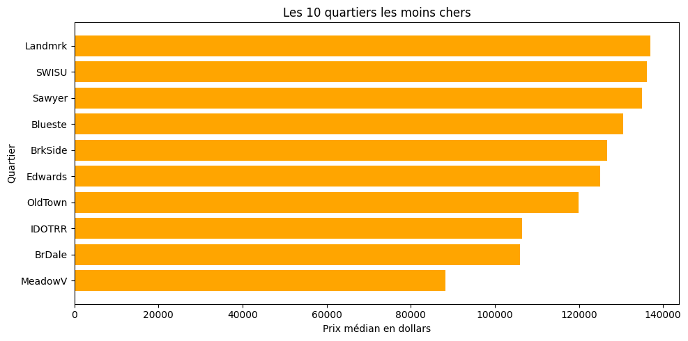
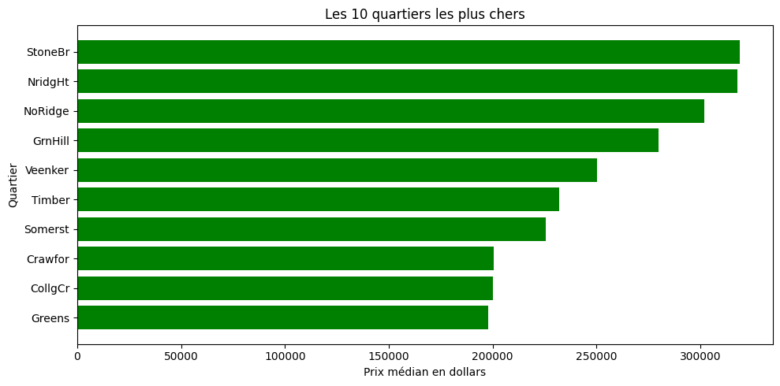
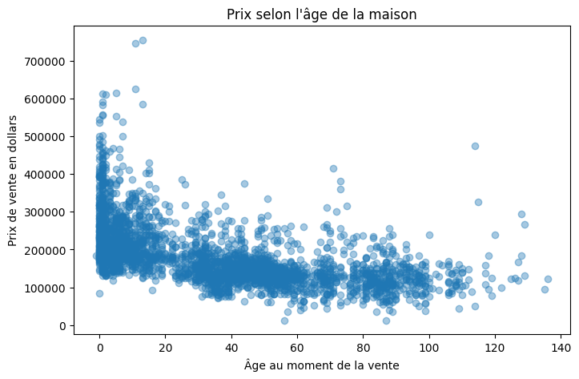
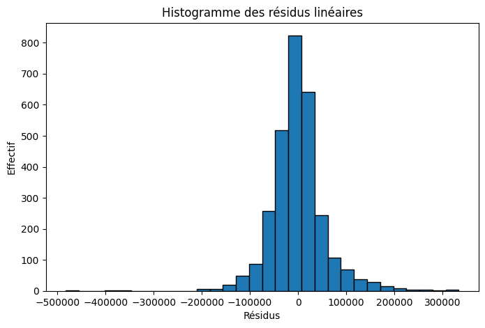
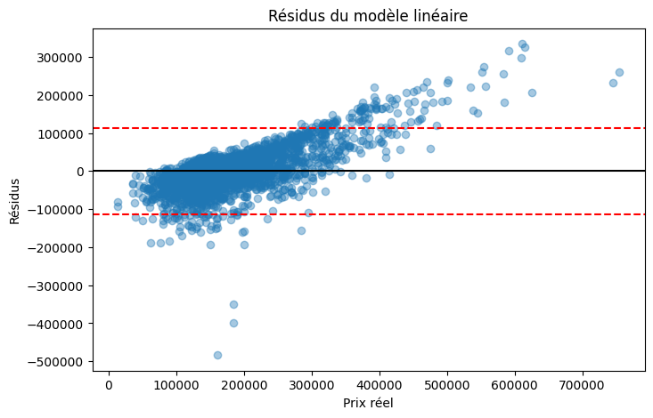
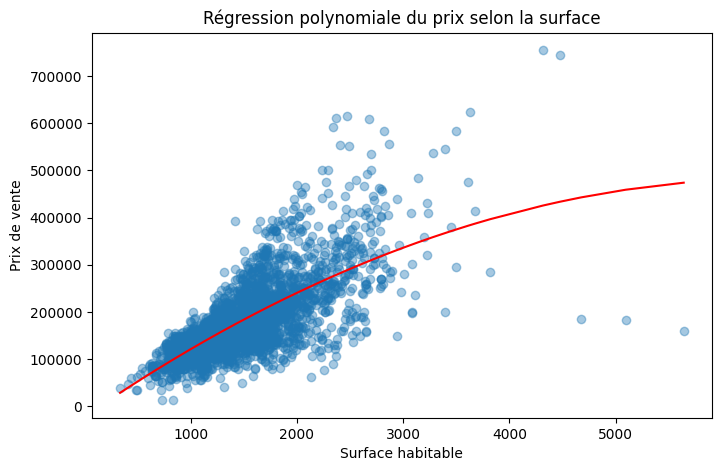

# Analyse du marché immobilier d'Ames

## Introduction

Ce projet étudie le jeu de données **Ames Housing**, trouvé sur Kaggle. Il
contient des informations sur des maisons vendues à Ames, une ville située dans
l'Iowa aux États-Unis.

L'objectif est d'analyser les caractéristiques des logements et de comprendre
les éléments qui influencent leur prix de vente.

## Problématique

> **Quelles caractéristiques influencent le prix de vente des maisons à Ames ?**

Dans un second temps, nous cherchons à savoir si la surface habitable permet
d'estimer correctement le prix d'une maison à l'aide d'une régression.

## Présentation des données

Le fichier `AmesHousing.csv` contient :

- **2 930 lignes**, correspondant aux maisons vendues ;
- **82 colonnes**, correspondant aux caractéristiques des maisons ;
- `SalePrice`, le prix de vente en dollars ;
- des informations sur la surface, la qualité, le quartier, l'année de
  construction, les rénovations et les équipements.

Les surfaces sont exprimées en pieds carrés, car les données proviennent des
États-Unis.

## Outils utilisés

- **Python** pour réaliser l'étude ;
- **pandas** pour lire et manipuler les données ;
- **matplotlib** pour créer les graphiques ;
- **numpy** pour les calculs et les régressions.

## 1. Vérification et nettoyage

Une copie du tableau original est créée dans `df_clean` afin de ne pas modifier
directement les données importées.

### Doublons

Le programme détecte **0 doublon**. Par conséquent :

- aucune ligne n'a été supprimée ;
- les **2 930 maisons** sont conservées pour l'analyse.

### Valeurs manquantes

Pandas détecte **15 749 valeurs manquantes**, réparties dans **27 colonnes**.
Les colonnes les plus concernées sont :

| Colonne | Valeurs manquantes | Pourcentage |
|---|---:|---:|
| `Pool QC` | 2 917 | 99,56 % |
| `Misc Feature` | 2 824 | 96,38 % |
| `Alley` | 2 732 | 93,24 % |
| `Fence` | 2 358 | 80,48 % |
| `Mas Vnr Type` | 1 775 | 60,58 % |
| `Fireplace Qu` | 1 422 | 48,53 % |
| `Lot Frontage` | 490 | 16,72 % |

Ces valeurs n'ont pas toutes la même signification. Par exemple, une valeur
manquante dans `Pool QC` indique généralement que la maison ne possède pas de
piscine. Pour `Lot Frontage`, elle signifie plutôt que la largeur du terrain
donnant sur la rue n'a pas été renseignée.

Nous avons donc choisi de **ne pas supprimer toutes les lignes contenant une
valeur manquante**, car cela ferait perdre beaucoup de maisons. Les variables
utilisées pour les régressions, `Gr Liv Area` et `SalePrice`, ne contiennent pas
de valeur manquante.

## 2. Étude du prix de vente

Les principales statistiques de `SalePrice` sont :

| Indicateur | Prix |
|---|---:|
| Minimum | 12 789 $ |
| Premier quartile | 129 500 $ |
| Médiane | 160 000 $ |
| Moyenne | 180 796 $ |
| Troisième quartile | 213 500 $ |
| Maximum | 755 000 $ |



La majorité des maisons est vendue entre environ 100 000 et 200 000 dollars.
La distribution est asymétrique vers la droite : quelques maisons très chères
augmentent la moyenne, qui est supérieure à la médiane.

## 3. Surface habitable et prix

La variable `Gr Liv Area` correspond à la surface habitable située au-dessus du
sol. Sa corrélation avec le prix est de **0,71**.



La relation est positive : les grandes maisons ont généralement un prix plus
élevé. Cependant, des maisons ayant une surface proche peuvent avoir des prix
très différents. La surface n'est donc pas le seul facteur qui intervient.

## 4. Qualité générale et prix

`Overall Qual` attribue à chaque maison une note de qualité comprise entre 1 et
10. La corrélation entre cette note et le prix est de **0,80**.



Le prix moyen augmente fortement avec la qualité :

- qualité 1 : **48 725 $** en moyenne ;
- qualité 5 : **134 753 $** en moyenne ;
- qualité 7 : **205 026 $** en moyenne ;
- qualité 10 : **450 217 $** en moyenne.

La qualité générale est le facteur étudié le plus fortement lié au prix.

## 5. Influence du quartier

Pour comparer les quartiers, nous utilisons le prix médian, moins sensible aux
maisons exceptionnellement chères que le prix moyen.

### Dix quartiers les moins chers



`MeadowV` possède le prix médian le plus faible, avec **88 250 $**. Il est suivi
par `BrDale`, avec **106 000 $**, et `IDOTRR`, avec **106 500 $**.

### Dix quartiers les plus chers



`StoneBr` possède le prix médian le plus élevé, avec **319 000 $**. Il est suivi
par `NridgHt`, avec **317 750 $**, et `NoRidge`, avec **302 000 $**.

Les différences observées montrent que le quartier joue un rôle important dans
le prix d'une maison.

## 6. Âge de la maison

L'âge au moment de la vente est calculé de la manière suivante :

```text
Âge de la maison = année de vente - année de construction
```



La corrélation entre l'âge et le prix est de **-0,56**. La relation est
négative : les maisons anciennes ont généralement tendance à être moins
chères. Cette relation n'est pas parfaite, car une maison ancienne peut avoir
été rénovée ou se trouver dans un quartier recherché.

L'ancienneté de la dernière rénovation présente également une corrélation
négative avec le prix, égale à **-0,53**. Une rénovation récente est donc
généralement associée à un prix plus élevé.

## 7. Capacité du garage

La corrélation entre `Garage Cars` et le prix est de **0,65**. Entre zéro et
trois places, le prix moyen augmente avec la capacité du garage :

| Places | Nombre de maisons | Prix moyen |
|---:|---:|---:|
| 0 | 157 | 104 949 $ |
| 1 | 778 | 127 267 $ |
| 2 | 1 603 | 183 562 $ |
| 3 | 374 | 310 305 $ |
| 4 | 16 | 228 749 $ |
| 5 | 1 | 126 500 $ |

Les résultats pour quatre et cinq places doivent être interprétés avec
prudence, car ils reposent sur très peu de maisons. Une maison possède une
valeur manquante pour cette variable, ce qui explique que le total du tableau
soit égal à 2 929 au lieu de 2 930.

## 8. Synthèse des corrélations

| Facteur | Corrélation avec le prix | Interprétation |
|---|---:|---|
| Qualité générale | 0,80 | Relation positive forte |
| Surface habitable | 0,71 | Relation positive forte |
| Capacité du garage | 0,65 | Relation positive assez forte |
| Âge de la maison | -0,56 | Relation négative modérée |
| Ancienneté de la rénovation | -0,53 | Relation négative modérée |

Une corrélation indique une association entre deux variables, mais elle ne
prouve pas à elle seule qu'une variable est la cause directe de l'autre.

## 9. Régression linéaire

Une régression linéaire est construite pour estimer `SalePrice` uniquement à
partir de `Gr Liv Area`.


La droite confirme la relation positive entre la surface et le prix. Le modèle
obtient les résultats suivants :

- **R² : 0,50** ;
- **écart-type des résidus : 56 514,52 $**.

Le R² signifie que la surface habitable explique environ **50 % de la variation
des prix**. La moitié restante dépend d'autres facteurs ou n'est pas expliquée
par cette droite.

### Analyse des résidus

Un résidu correspond à la différence entre le prix réel et le prix estimé :

```text
Résidu = prix réel - prix estimé
```





Les résidus sont globalement centrés autour de zéro, mais plusieurs valeurs
atypiques sont présentes. Leur dispersion montre que la surface seule ne
permet pas d'estimer précisément toutes les maisons, notamment certains biens
très chers ou possédant des caractéristiques particulières.

## 10. Régression polynomiale

Une régression polynomiale de degré 2 est ensuite testée afin de vérifier si une
courbe représente mieux la relation entre la surface et le prix.



| Modèle | R² | Écart-type des résidus |
|---|---:|---:|
| Régression linéaire | 0,50 | 56 514,52 $ |
| Régression polynomiale | 0,51 | 56 144,96 $ |

Le modèle polynomial améliore le R² de seulement **0,01** et réduit l'écart-type
des résidus d'environ **370 $**. Cette amélioration reste faible. Le modèle
linéaire peut donc être conservé pour sa simplicité.

## Conclusion

Cette étude montre que le prix des maisons à Ames est lié à plusieurs
caractéristiques :

- la qualité générale est le facteur étudié le plus fortement corrélé au prix ;
- la surface habitable et la capacité du garage ont une relation positive avec
  le prix ;
- les maisons anciennes ou rénovées depuis longtemps ont tendance à être moins
  chères ;
- les prix médians diffèrent fortement selon les quartiers.

La surface habitable constitue un facteur important, mais elle ne suffit pas à
expliquer seule le prix de vente. Pour améliorer les estimations, un futur
modèle pourrait intégrer simultanément la qualité, le quartier, l'âge et le
garage.

## Limites de l'étude

- Les valeurs manquantes n'ont pas toutes été traitées, car certaines
  représentent l'absence d'un équipement.
- Les régressions utilisent uniquement la surface habitable.
- Quelques maisons atypiques influencent fortement les erreurs.
- Les résultats concernent la ville d'Ames et ne peuvent pas être généralisés
  directement à tous les marchés immobiliers.

## Organisation du projet

```text
Projet-Immobilier/
├── data/
│   └── AmesHousing.csv
├── images/
│   └── graphiques de l'analyse
├── analyse_immo.py
├── README.md
└── requirements.txt
```

## Exécution

Installer les bibliothèques nécessaires :

```bash
python3 -m pip install pandas matplotlib numpy
```

Lancer ensuite le programme depuis la racine du projet :

```bash
python3 analyse_immo.py
```

Le programme affiche les résultats dans le terminal et enregistre les
graphiques dans le dossier `images`.
